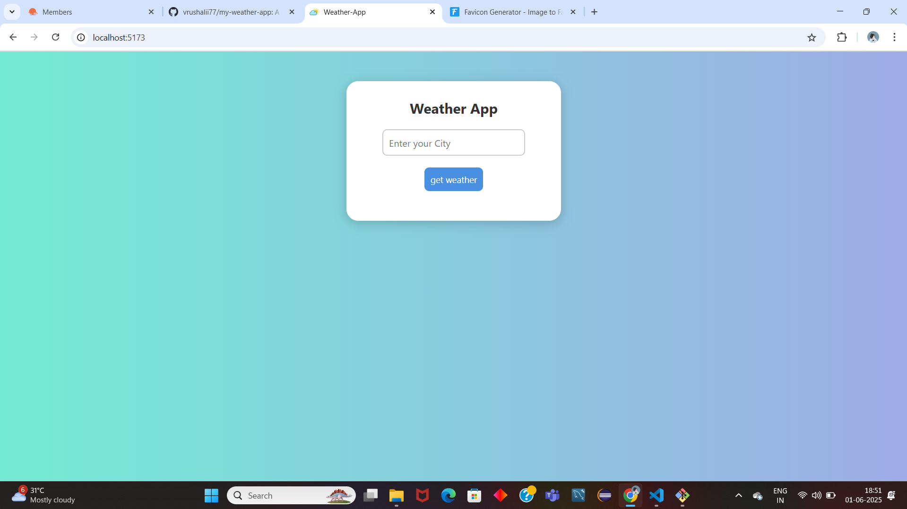
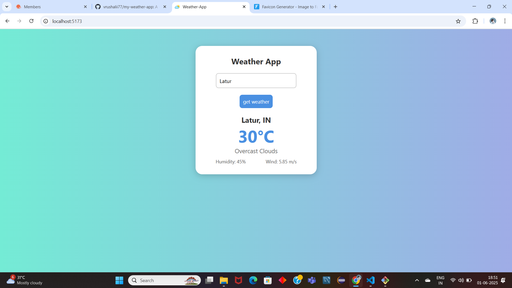

# Weather App using React

This is a simple Weather App built with React JS that shows real-time weather updates for any city using the **OpenWeatherMap API**.

## Features

-  Search weather by city name
-  Displays temperature in Celsius
-  Shows humidity and wind speed
-  Simple and clean UI
-  Responsive design for mobile and desktop

## Technologies Used

- React JS
- Axios (for API requests)
- OpenWeatherMap API
- HTML & CSS

##  Screenshots

1. User Interface of app

2. App performance

